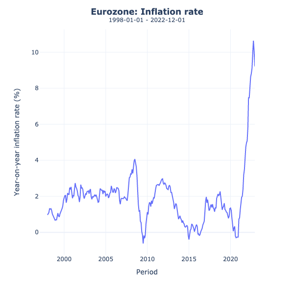
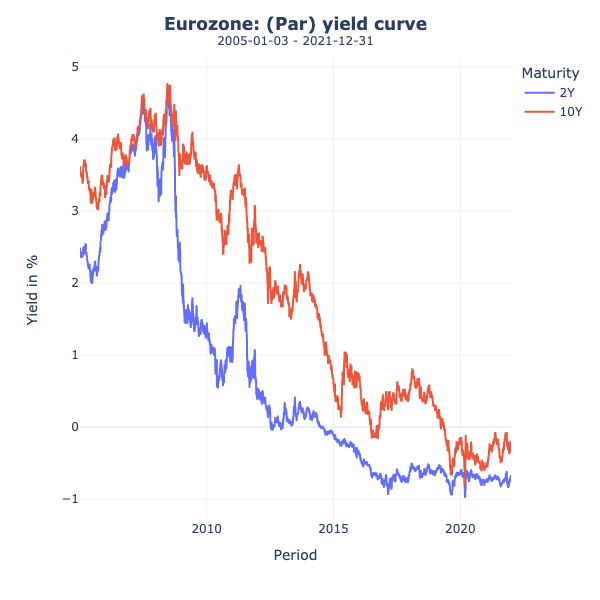
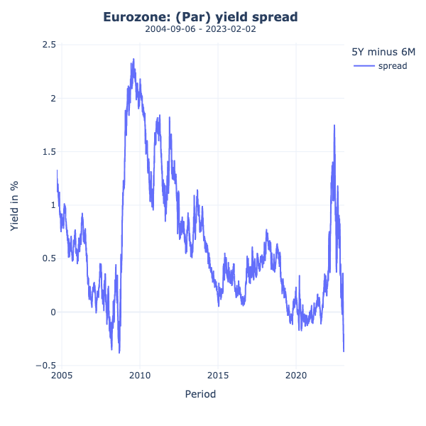

# ECB Data Retrieval - Python CLI


This repository provides a command-line interface to retrieve economic data from [European Central Bank's (ECB) SDMX API](https://sdw-wsrest.ecb.europa.eu/help/).

## Features
- Retrieve inflation index data (INX) 
- Retrieve yield curve data (YC) 
- Define custom start and end dates for data retrieval 
- Option to calculate yield spread 
- Option to save output as .PNG, interactive .HTML and time series as .CSV

## Requirements / Installation
- Python 3.x
- argparse library
- ast library

To install the required packages, navigate to the root directory of the project and run the following command.

```
pip install -r requirements.txt
```


## Usage
To generate a plot of the inflation rate in the Eurozone with total available data:

```
> init.py [-h]

options:
  -h, --help            show this help message and exit
  -b BEGIN, --begin BEGIN
                        Start date in YYYY-MM format. Can be used with each flag. When provided,
                        --end must be defined as well.
  -e END, --end END     End date in YYYY-MM format. Can be used with each flag. When provided,
                        --begin must be defined as well.

Inflation Options:
  -i, --inflation       Retrieves inflation data. When no period is provided, it retrieves maximum
                        available data history.

Yield Options:
  -y, --yield-curve     Retrieves yield curve data. When no period is provided, it retrieves
                        maximum available data history. When neither --shortterm nor --longterm is
                        given, it retrieves the 2Y10Y Par Yield.
  -s, --spread          Returns yield spread.
  -st {3M,6M,9M,1Y,2Y}, --shortterm {3M,6M,9M,1Y,2Y}
                        Define short-term par yield
  -lt {10Y,15Y,20Y,30Y}, --longterm {10Y,15Y,20Y,30Y}
                        Define long-term par yield
```

## Examples

### 1. Inflation data
Retrieve information about inflation rate in Eurozone using maximum available data history:

```
> init .py -b 2015-01 -e 2022-12
```

 Outputs:



You always get prompted to save output: 

````
Save output to the current folder? (y/n)
````

`y` will save the static image as .PNG, the interactive HTML and the .CSV file to output/ folder.


### 2. Yield data
Retrieve information about (par) yield curve in Eurozone using data from 2005-01 to 2021-12:

```
> init.py -y -b 2005-01 -e 2021-12
```

Outputs:



### 3. Yield data (spread)
Retrieve information about (par) yield spread (6M5Y):

```
> init.py -y -s -st 6M -lt 5Y
```

Outputs



## Future implementations
- get EXR data
- get GDP data


## Feedback & Contribution

If you have feedback, ideas for improving the project or found a bug , please open an issue.