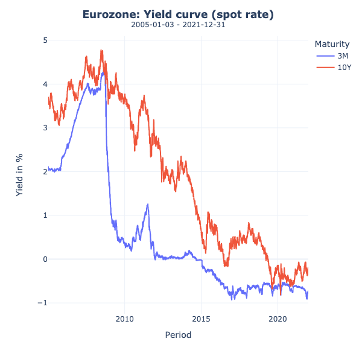
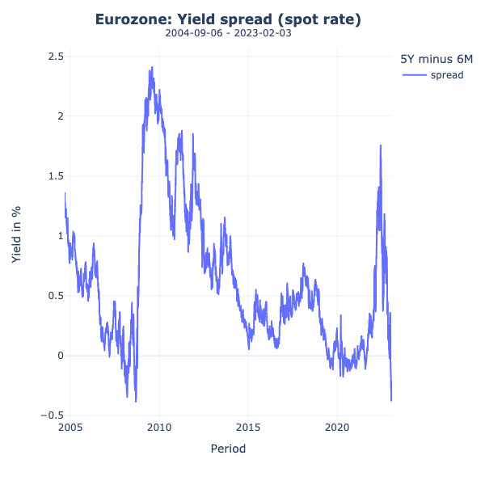
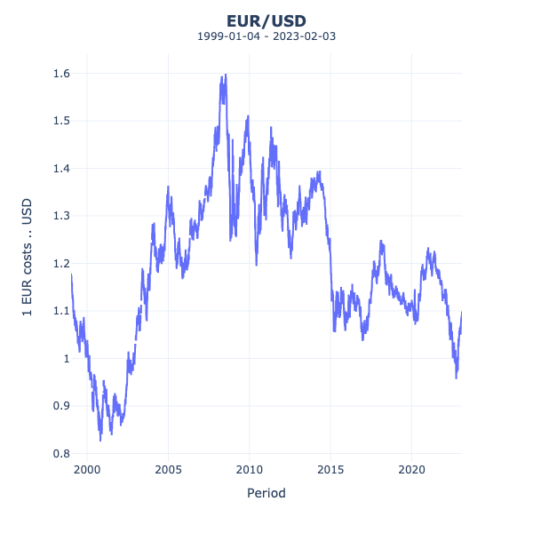
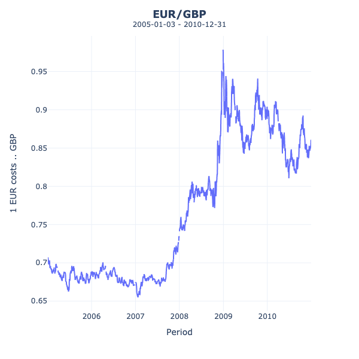
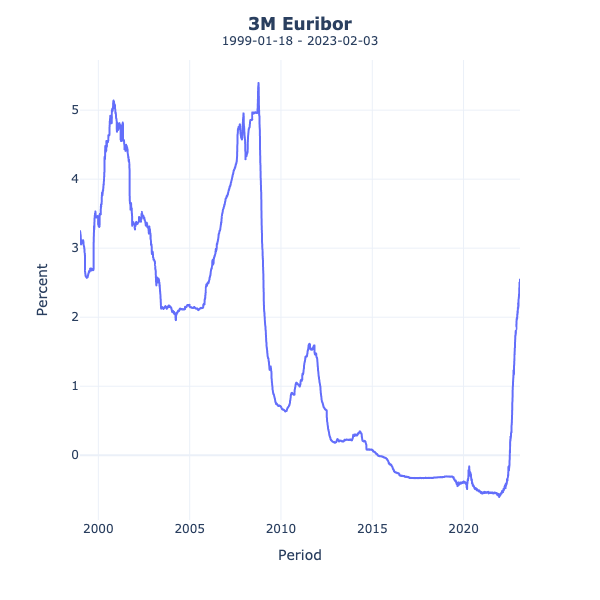
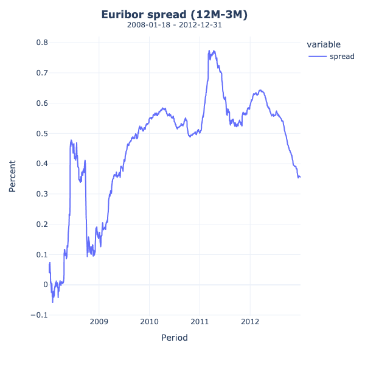
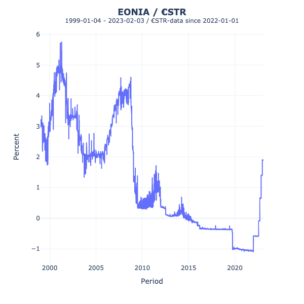

# European Central Bank/German Federal Bank - SDMX API Python CLI


This repository provides a command-line interface to retrieve economic data from [European Central Bank's (ECB)](https://sdw-wsrest.ecb.europa.eu/help/) and [German Federal Bank's](https://api.statistiken.bundesbank.de/doc/index.html?urls.primaryName=English%20REST%20API%20Documentation)  SDMX API.

## Features
- Retrieve inflation index data (INX) 
- Retrieve yield curve data (YC) 
- Retrieve exchange rate data (EXR)
- Retrieve Euribor rate
- Retreive Eonia + €STR *(EONIA time series continues seamlessly with the €STR)*
- Define custom start and end dates for data retrieval 
- Option to calculate spreads between long and short term period
- Option to save output as .PNG, interactive .HTML and time series as .CSV

## Requirements / Installation
- Python 3.x
- argparse library
- ast library

To install the required packages, navigate to the root directory of the project and run the following command.

```
pip install -r requirements.txt
```


## Usage


```
> init.py [-h]

usage: init.py [-h] [-i] [-y] [-fx] [-c CURRENCY] [-b BEGIN] [-e END] [-s] [-st SHORTTERM] [-lt LONGTERM] [-eur] [-eon]

Interface to retrieve economic data from official SDMX API of European Central Bank and German Federal Bank.

options:
  -h, --help            show this help message and exit
  -b BEGIN, --begin BEGIN
                        Start date in YYYY-MM format. Can be used with each flag. When provided, --end must be defined as well.
  -e END, --end END     End date in YYYY-MM format. Can be used with each flag. When provided, --begin must be defined as well.
  -s, --spread          Returns spread of long and short term series.
  -st SHORTTERM, --shortterm SHORTTERM
                        Define short-term period for time series. Works with --yield-curve and --euribor. (Yield: ['3M', '6M', '9M', '1Y', '2Y'], Euribor: ['1W', '1M',
                        '3M', '6M', '9M', '12M']
  -lt LONGTERM, --longterm LONGTERM
                        Define short-term period for time series. Works with --yield-curve and --euribor. (Yield: ['5Y','10Y', '15Y', '20Y', '30Y'], Euribor: ['1W',
                        '1M', '3M', '6M', '9M', '12M'])

INFLATION:
  -i, --inflation       Retrieves inflation data. When no period is provided, it retrieves maximum available data history.

YIELD:
  -y, --yield-curve     Retrieves yield curve data. When no period is provided, it retrieves maximum available data history. When neither --shortterm nor --longterm is
                        given, it retrieves the 2Y10Y Spot Yield.

EXCHANGE RATE:
  -fx, --exchange-rate  Retrieves exchange rate data. When no period is provided, it retrieves maximum available data history.
  -c CURRENCY, --currency CURRENCY
                        Define the currency for which exchange rate data should be retrieved

EURIBOR:
  -eur, --euribor       Retrieves Euribor data. When no period is provided, it retrieves maximum available data history.

EONIA:
  -eon, --eonia         Retrieves Eonia data. When no period is provided, it retrieves maximum available data history. This function takes EONIA history until last day
                        (2021-12-31) and continues with up-to-date €STR data.
```

## Examples

### 1. Inflation data
Retrieve information about monthly inflation rate in Eurozone using maximum available data history:

```
> python init.py -i -b 2015-01 -e 2022-12
```

 Outputs:


You always get prompted to save output: 

````
Save output to the current folder? (y/n)
````

`y` will save the static image as .PNG, the interactive HTML and the .CSV file to output/ folder.


### 2. Yield data
Retrieve information about daily (spot) yield curve in Eurozone using data from 2005-01 to 2021-12:

```
> python init.py -y -b 2005-01 -e 2021-12
```

Outputs:



### 3. Yield data (spread)
Retrieve information about daily (spot) yield spread (6M5Y):

```
> python init.py -y -s -st 6M -lt 5Y
```

Outputs



### 4. Exchange rate data (FX)
Retrieve information about daily EUR/USD exchange rate with maximum available time series data:

```
> python init.py -fx
```

Outputs:



### 5. Exchange rate data for e.g. GBP
Retrieve information about daily EUR/GBP exchange rate during January 2005 till December 2010:

```
> python init.py -fx -c GBP -b 2005-01 -e 2010-12
```

Outputs:



### 6. Euribor data 
Retrieve 3-month Euribor:

```
> python init.py -eur 
```


### 7. Euribor data (spread)
Retreive spread between 3-month and 12-month Euribor during January 2008 and December 2012:

```
> python init.py -eur --begin 2008-01-01 --end 2012-12-31 -st 3M -lt 12M --spread
```



### 8. EONIA / €STR

Retreive EONIA data for maximu available period.

**Since EONIA has been stopped calculating end of 2021, this function continues the EONIA series with up-to-date €STR data.**

```
> python init.py -eon
```


## Feedback & Contribution

If you have feedback, ideas for improving the project or found a bug , please open an issue.
