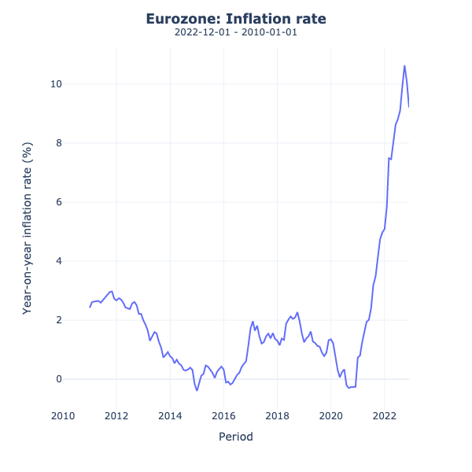

# Inflation Rate (Primary Source) CLI

This repository provides a Python implementation to retrieve monthly inflation index data (ICP) from [European Central Bank's (ECB) SDMX API](https://sdw-wsrest.ecb.europa.eu/help/).
It plots the year-on-year inflation rate using Plotly Express.

## Installation

To install the required packages, navigate to the root directory of the project and run the following command.

```
pip install -r requirements.txt
```


## How to use

To generate a plot of the inflation rate in the Eurozone with total available data:

```
> init.py
```

To save the output:

```
> init.py -s True
```

To generate a plot of inflation rate in Eurozone with custom data range:

```
> init .py -b 2015-01 -e 2022-12
```

## Example

Get inflation data from January 2010 till end of year 2022.

```
> init.py -b 2010-01 -e 2022-12 -s True
```

